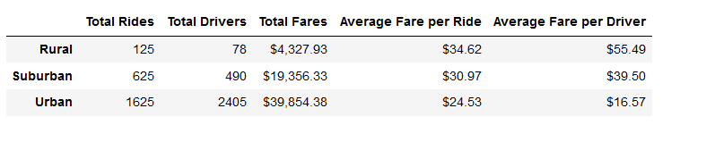
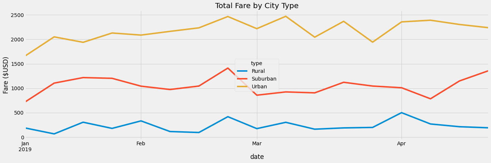

# PyBer_Analysis
# Purpose:
The purpose of the PyBer analysis is to show the total weekly fares for the urban, suburban and rural city types.  

# Results:
The data was collected from the city rides dataframe which presented the following headings: city, driver_count, type(urban, suburban, rural) and the ride dataframe, which presented the following headings: city, date, fare, ride id.  The two data frames where then merged into one data frame the PyBer Data Dataframe.

Here are the results that answer the following questions all based on the three different city types: Urban, Suburban and Rural.
- Total rides
- Total drivers
- Total fares
- Avererage fare per ride
- Average fare per driver 

# Summary:
The line graph represents the results of total fares from January to April for the urban, suburban, rural city types.  It shows that the strongest "sales" were for the urban city type and the least "sales" were for the rural city type.  As to my opinion, the results are to be expected.  More of the rural population have their own vehicles because they must drive more and further for their everyday activities, it's economical for them to own a car then to take a rideshare service. The urban population however takes our service more often for shorter and quicker rides around the urban area.    

